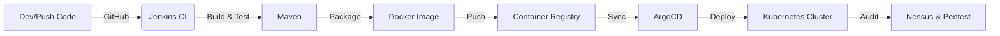

# Secure Java Application CI/CD Deployment & VAPT on Kubernetes

## Project Overview
This capstone project demonstrates a complete **DevSecOps lifecycle**. It involves developing a Java web application, automating its deployment using a CI/CD pipeline, orchestrating it with Kubernetes (via GitOps), and performing rigorous security testing (VAPT).

**Objective:** To simulate a real-world enterprise environment for building, deploying, automating, and securing applications using industry-standard tools.

---

## Project Resources & Deliverables

Here are the direct links to the project artifacts and reports:

| Resource | Link |
| --- | --- |
| **Source Code** | [Java Application Repository](https://github.com/mukimsoft/Final-Project) |
| **CI Pipeline** | [Jenkinsfile](https://github.com/mukimsoft/Final-Project/blob/main/Jenkinsfile) |
| **Container Config** | [Dockerfile](https://github.com/mukimsoft/Final-Project/blob/main/Dockerfile) |
| **K8s Manifests** | [Kubernetes Repository](https://github.com/mukimsoft/Final-Project/tree/main/k8s) |

### Security & Evidence Reports

* **Nessus Vulnerability Report:** [View Report](https://github.com/mukimsoft/Final-Project/blob/main/Report/Nessus_vulnerability_scan_report.txt)
* **ArgoCD Sync Screenshot:** [View Image](https://github.com/mukimsoft/Final-Project/blob/main/screenshot/WhatsApp%20Image%202026-01-16%20at%206.41.38%20PM.jpeg)
* **Live App Access:** [View Image](https://github.com/mukimsoft/Final-Project/blob/main/screenshot/WhatsApp%20Image%202026-01-16%20at%206.41.53%20PM.jpeg)
* **Penetration Test Proof:** [View Image](https://github.com/mukimsoft/Final-Project/blob/main/screenshot/WhatsApp%20Image%202026-01-17%20at%201.02.31%20AM.jpeg)
* **Hardening Recommendations:** [View Documents](https://github.com/mukimsoft/Final-Project/tree/main/screenshot)

---

## Technology Stack

| Category | Technology / Tool |
| :--- | :--- |
| **Application** | Java, JDBC, MySQL |
| **Source Control** | Git, GitHub |
| **CI / Build** | Jenkins, Maven |
| **Containerization** | Docker, Docker Hub |
| **Orchestration** | Kubernetes (K8s) |
| **GitOps / CD** | ArgoCD |
| **Security (VAPT)** | Nessus, Burp Suite, Nmap |
| **OS** | Windows 10 |

---

## CI/CD & Security Workflow

---

## Key Implementation Phases

### 1. Application Development

* Developed a Java-based web application with database interaction.
* Implemented user registration, login, and record management.

### 2. Continuous Integration (Jenkins)

* Automated source code checkout and Maven build.
* Unit testing and Docker image creation.
* Pushing images to the container registry.

### 3. Kubernetes & GitOps (ArgoCD)

* **Namespace:** `ba-cirt-infra`
* **Domain:** `ba-industrial-training.com`
* Deployed using declarative manifests synced via ArgoCD.

### 4. Security Assessment (VAPT)

* **Vulnerability Assessment:** Scanned using Nessus to identify risks and CVSS scores.
* **Penetration Testing:** Manual testing for OWASP Top 10 vulnerabilities using Burp Suite.

## Skills Gained

* Java Backend Development
* Linux Server Administration
* Docker & Kubernetes Management
* GitOps Principles
* Vulnerability Assessment & Penetration Testing

---

*Project completed as part of the Business Automation Industrial Training.*

---